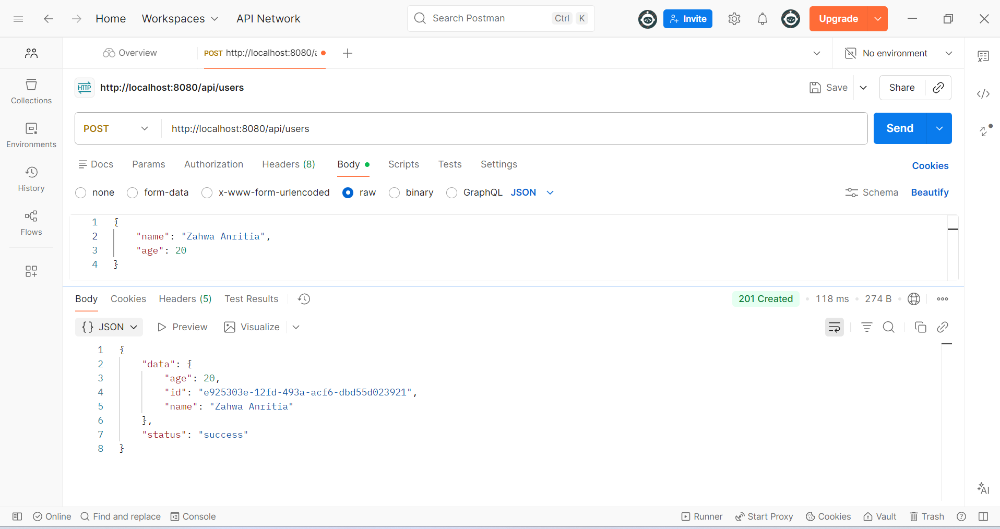
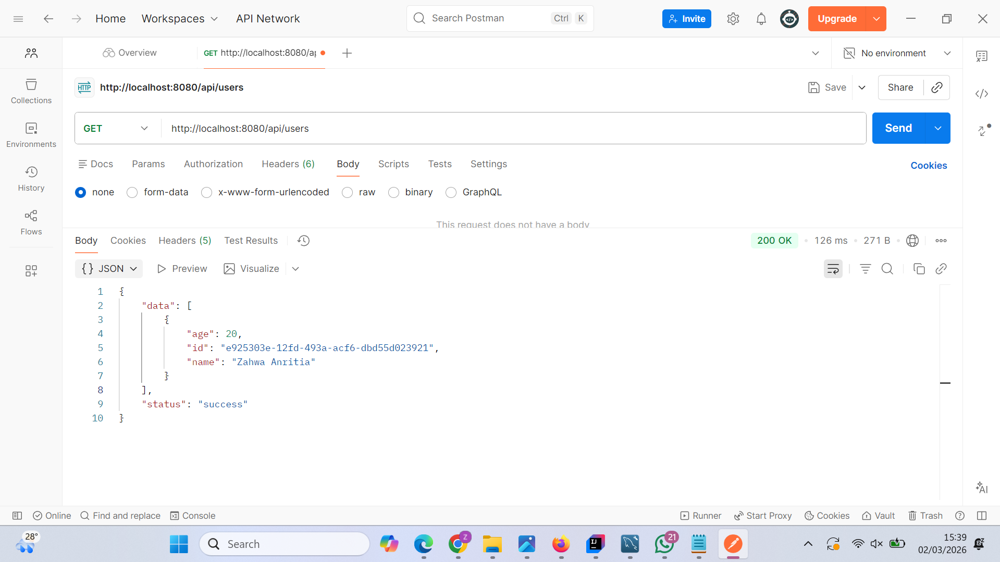
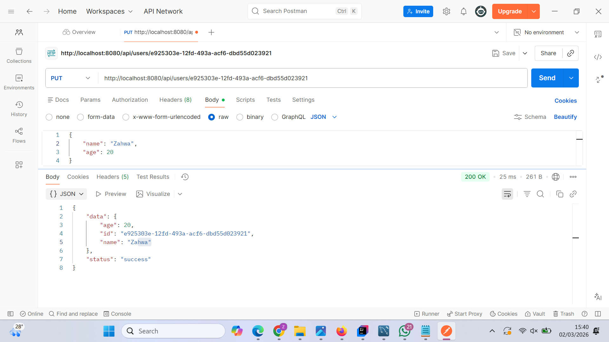
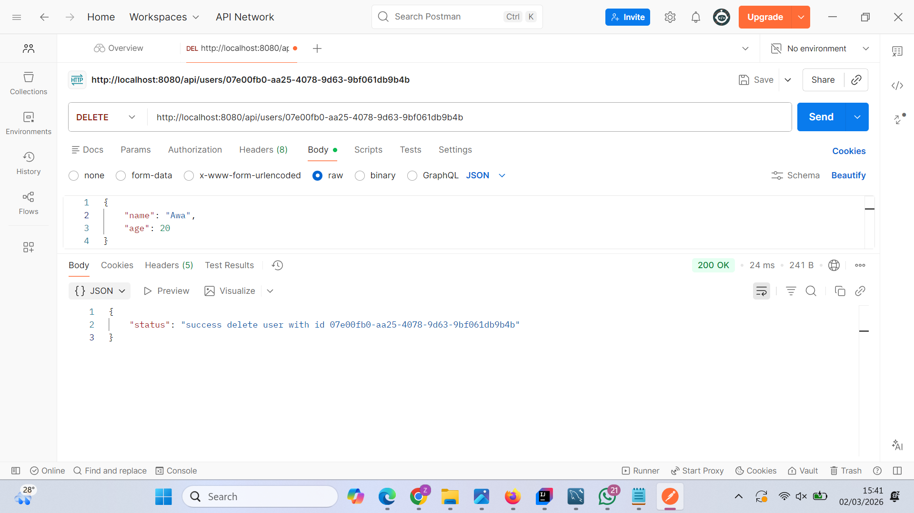
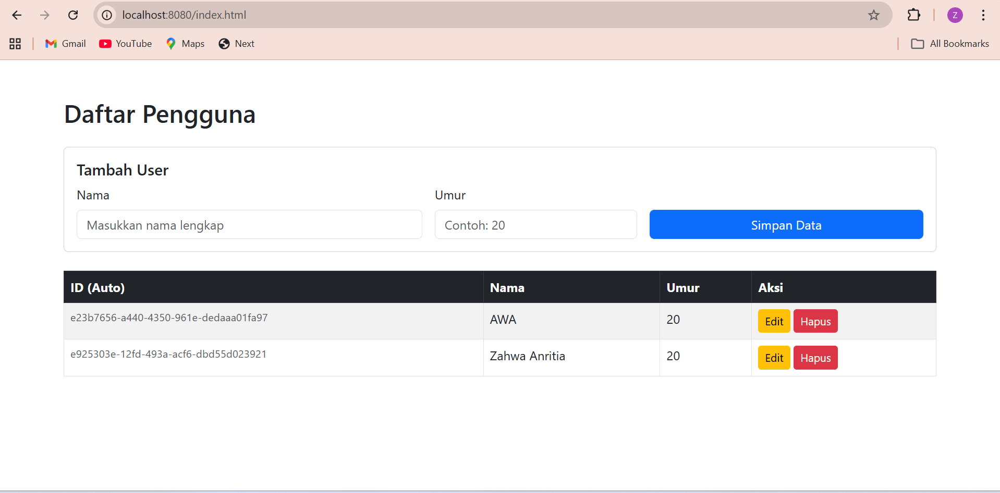
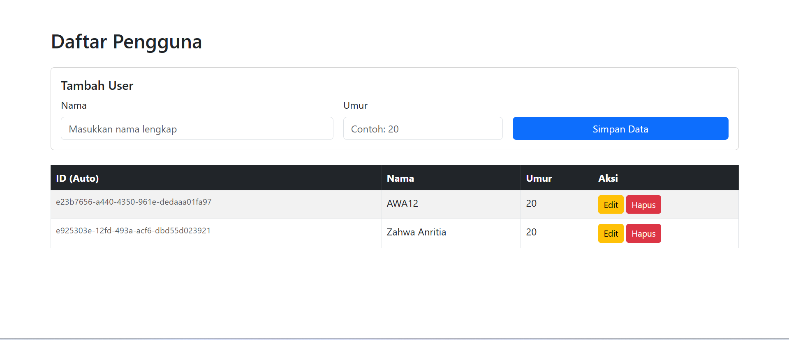
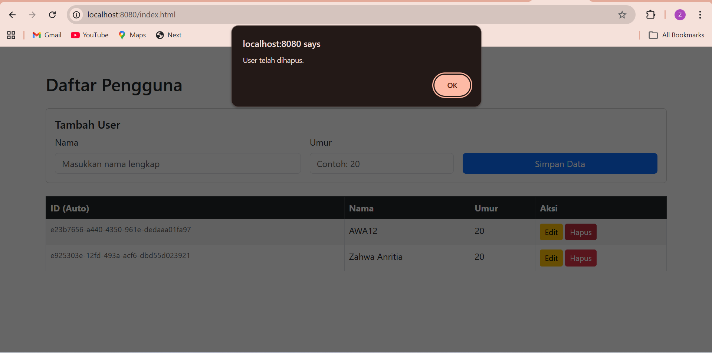
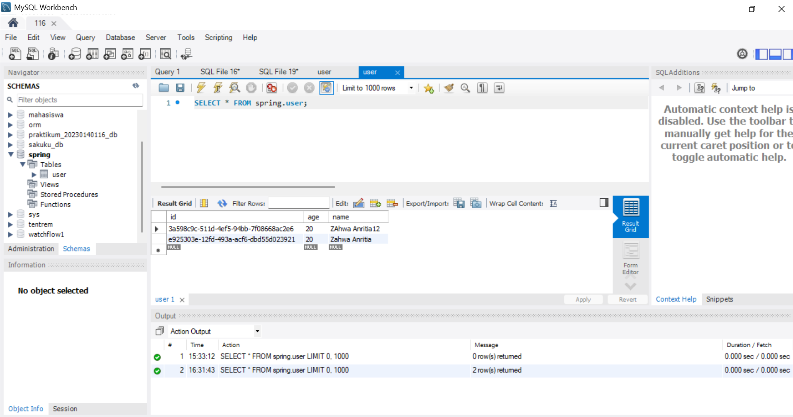

## API Endpoint

### 🔹 Create User
POST  
http://localhost:8080/api/users

### 🔹 Get All Users
GET  
http://localhost:8080/api/users

### 🔹 Update User
PUT  
http://localhost:8080/api/users/{id}

### 🔹 Delete User
DELETE  
http://localhost:8080/api/users/{id}

## Dokumentasi 

## Database

